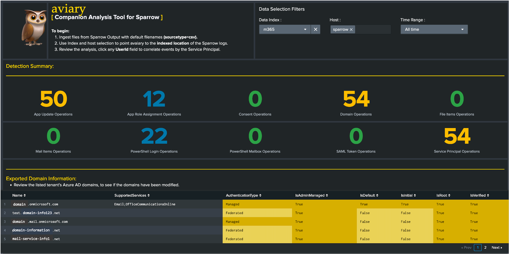
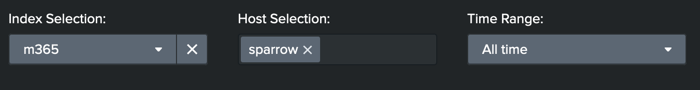
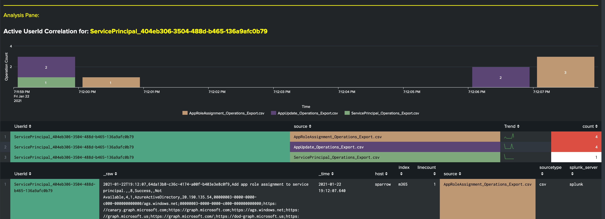

# aviary

  

<b>Authors: Ryan Fetterman, Taylor Meckley

Aviary is a Splunk-based analysis dashboard for reviewing the logging output of the Sparrow incident response script (https://github.com/cisagov/Sparrow). Sparrow.ps1 was created by CISA's Cloud Forensics team to help detect possible compromised accounts and applications in the Azure/m365 environment. Sparrow is intended to narrow a larger set of available investigation modules and telemetry to those specific to recent attacks on federated identity sources and applications.

Aviary is based on MITRE's testing of emulated adversary activities in a test Azure/m365 environment, and provides formatted event review and trending, and allows analysts to interact to correlate observed activities.  

### Recognized data sources from Sparrow include*:
<ul>
<li> AppUpdate_Operations_Export.csv</li>
<li> AppRoleAssignment_Operations_Export.csv</li>
<li> Consent_Operations_Export.csv</li>
<li> Domain_List.csv</li>
<li> Domain_Operations_Export.csv</li>
<li> FileItems_Operations_Export.csv</li>
<li> MailItems_Operations_Export.csv</li>
<li> PSLogin_Operations_Export.csv</li>
<li> PSMailbox_Operations_Export.csv</li>
<li> SAMLToken_Operations_Export.csv</li>
<li> ServicePrincipal_Operations_Export.csv</li>
 
*Note: All detailed results panels are coniditional, they will only appear if there is recognized data to display.
  

### Directions:
<ol>
<li> Ingest Sparrow logs (sourcetype=csv)</li>
<li> Import aviary .xml code into new Dashboard</li>
<li> Point aviary to Sparrow data using the index and host selection:</li>
     

<li>Review the output. Click any UserId field value to correlate activity by the Service Principal.</li>

</ol>

